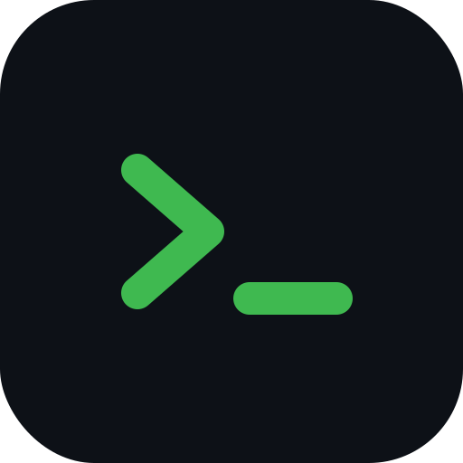
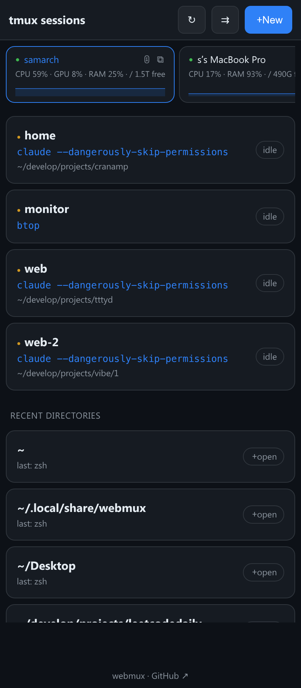
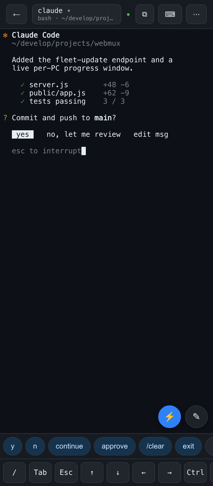
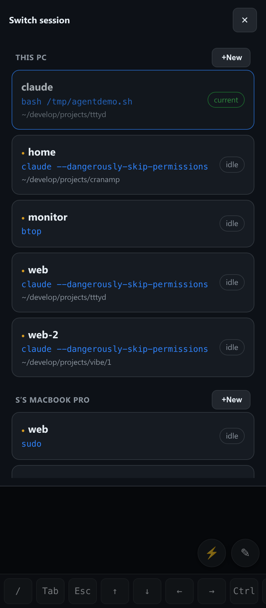
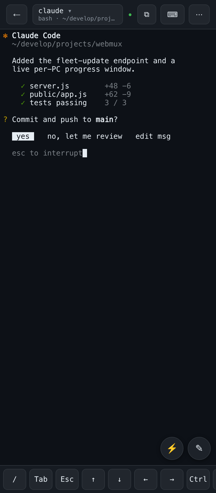
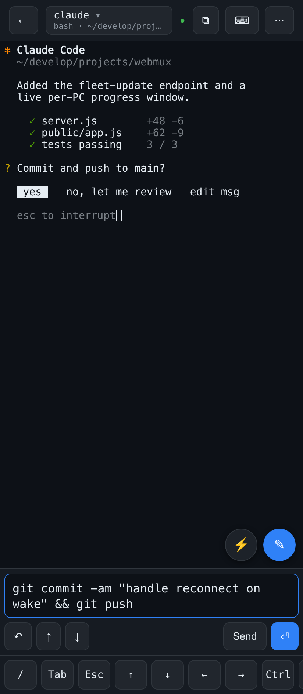

<h1 align="center">webmux</h1>

<p align="center"><b>Every terminal on every computer you own — in your pocket.</b></p>

<p align="center">
  
</p>

https://github.com/user-attachments/assets/f6fbf494-1de4-47cb-b80e-32f76660511e

<p align="center">
A tiny self-hosted <b>web terminal for your tmux sessions</b>, built for phones. Run your long-lived
terminals — coding agents, dev servers, builds — in tmux on your machines at home; check on and steer
them from your phone, <b>from anywhere</b>, over your private Tailscale network.
</p>

---

<p align="center">
  
  &nbsp;
  
  &nbsp;
  
</p>

## Why you'll want this

You run `claude`, `codex`, dev servers, and builds in **tmux on your big machine**. Then you leave the desk.

webmux puts a real terminal in your pocket. From your phone, anywhere on your private network:

- **See everything at a glance** — every session on every machine, with its live command and directory, plus each box's **CPU / GPU / RAM / free disk** at the top. You instantly know where the action is.
- **Jump in and steer** — read what your agent is doing, **answer its prompt with one tap** (`y` · `continue` · `approve`), paste a fix, `^C` a runaway, scroll back through the output.
- **Nothing is ever lost** — every session lives in tmux on the PC, so when your phone sleeps, drops Wi-Fi, or switches to cellular, webmux just re-attaches. Pick up exactly where you left off — and when you're back at the desk, the same session is right there in a real terminal window.

It's *"keep an eye on the agents running at home, from the train."*

## What makes it nice

<table>
<tr>
<td width="50%" valign="top">

**📟 Built for thumbs**
A full terminal over WebSocket with momentum scrolling, a soft-key bar (`Tab Esc ↑↓←→ Ctrl ^C …`), and a keyboard-aware layout. Installable as a home-screen app (PWA).

**✍️ Type without fighting your keyboard**
A compose field where predictive text / T9 work *without* the character-doubling you get typing straight into a terminal — with a **navigable input history**, auto-grow, and an **undo** for accidental big pastes.

**⚡ One-tap answers**
A row of editable quick-reply chips (`y` / `continue` / `approve` / …) to answer agents without the keyboard — **synced across all your machines**.

**🔎 Find anything**
Search the scrollback with match-count and next/prev.

</td>
<td width="50%" valign="top">

**🖥️ One app for every box**
Discovers your other webmux instances over [Tailscale](https://tailscale.com) and shows them as **live machine cards** (CPU/GPU/RAM/disk + a CPU sparkline; tap for top processes, temperature, uptime). The session switcher lists **every machine's sessions, grouped by box**.

**🚀 Run it everywhere at once**
Push a command to your **whole fleet** and see each machine's output. **Update every box** to the latest with one tap and a live progress window.

**🔔 It pings you**
Opt-in push notifications when a session that was busy goes quiet — *your agent finished and is waiting.* Tap to jump straight in.

**🪟 Always at your desk too**
New sessions also open a **real terminal window on the PC**, so when you sit back down it's right where the phone left it.

</td>
</tr>
</table>

<p align="center">
  
  &nbsp;
  
</p>

## Install

```sh
curl -fsSL https://raw.githubusercontent.com/samoylenkodmitry/webmux/main/install.sh | bash
```

Installs a background service on `127.0.0.1:8083` (systemd on Linux, launchd on macOS) and can configure your private **Tailscale** share for you. Then open the printed `https://…ts.net` URL on your phone and **Add to Home Screen**.

**Requires** Node ≥ 18, npm, tmux, and a C toolchain for the native PTY module. **Linux & macOS** (Windows via WSL). To update later — or update your whole fleet — just hit **⬆ Update** in the menu.

> [!IMPORTANT]
> webmux has **no authentication** — anyone who can reach the port gets a shell as you. That's intentional and safe *only* because it binds to `127.0.0.1` and you expose it through your private Tailscale tailnet (which authenticates devices). **Never** bind it to `0.0.0.0`, the public internet, or a `tailscale funnel`. Treat the URL like SSH access to your machine.

## Docs

Configuration, the HTTP/WebSocket API, how the fleet update and activity alerts work, and other internals live in **[docs/TECHNICAL.md](docs/TECHNICAL.md)**.

Built with [xterm.js](https://xtermjs.org/); the backend bridges a WebSocket to `tmux attach` over a real PTY.

## License
MIT
